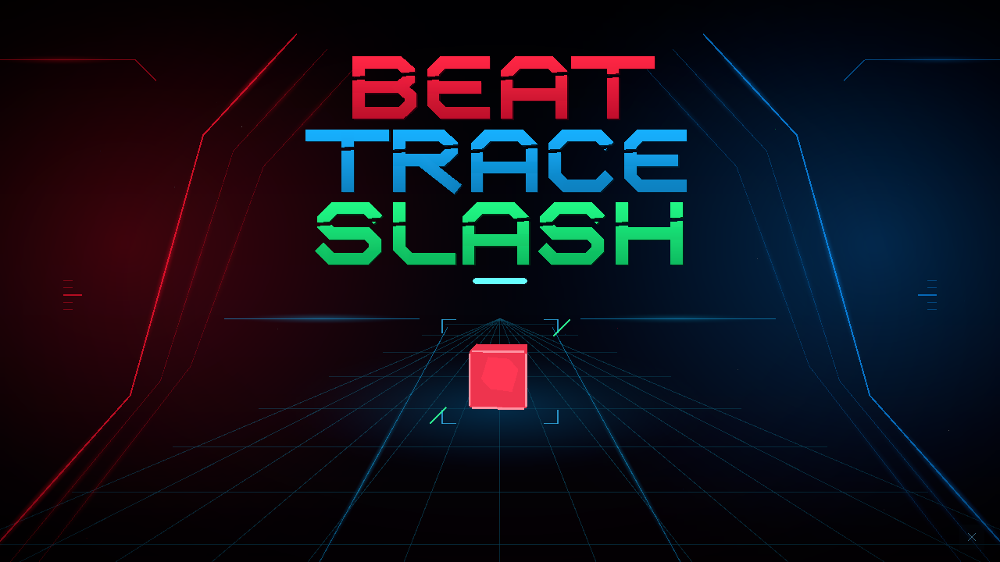
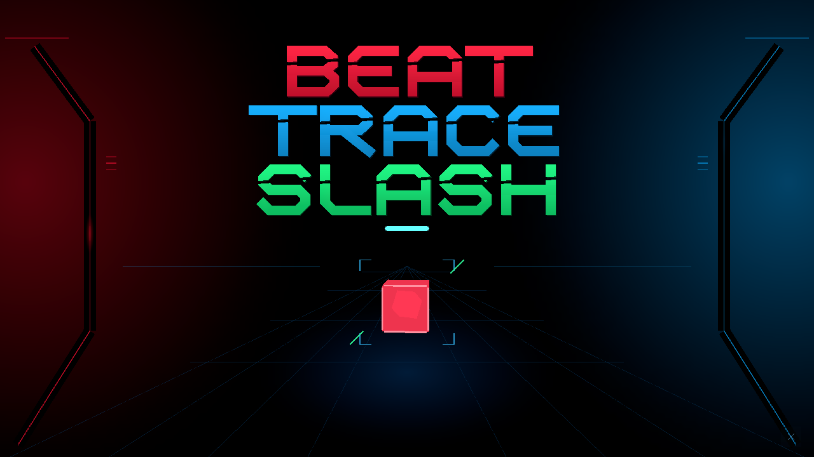
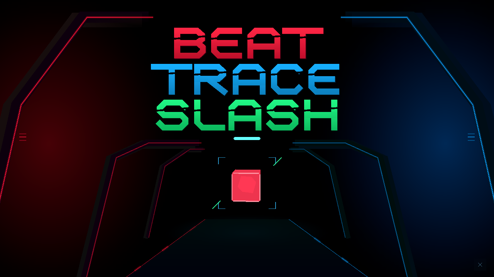
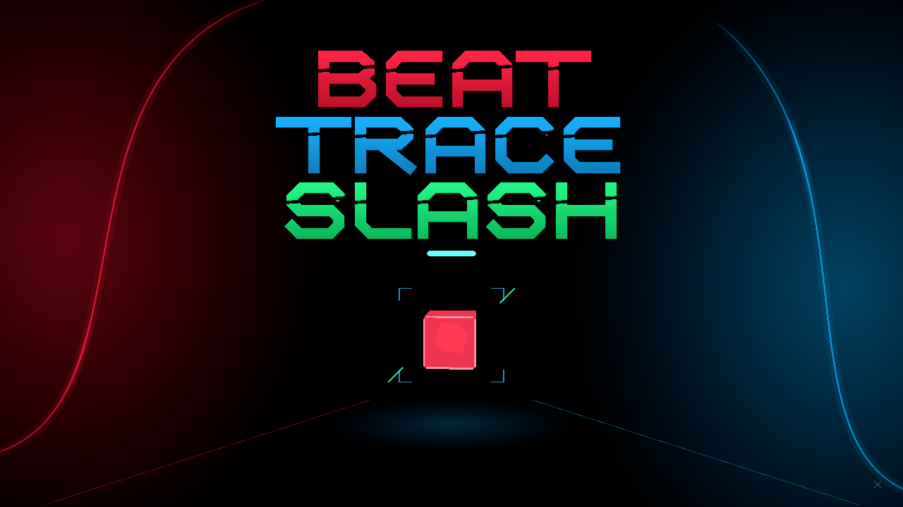

# タイトルの背景とアニメーション

文字はユーザーが選んだ **候補1（A）の専用字形** に統一しました。BEAT / TRACE / SLASHの3段、赤・青・緑、太い直立文字の切断面を全背景で共通にしています。ロゴは文字の輪郭から作るUIメッシュで、既存フォントや生成画像は使いません。

タイトルを開くたびに4種類の背景からランダムに選びます。アプリ起動中は直前と同じ背景が続かないようにし、選曲画面から戻ったときも抽選します。アプリを終了した後は前回の選択を保持しません。

## 背景ごとの動き

| 番号 | 背景 | 登場 | 待機 | ノーツを切って開始 |
| --- | --- | --- | --- | --- |
| 0 | 元のレールと床 | 奥からレールと床の線が組み上がる | 光がゆっくり呼吸し、星と床の光が流れる | レールが少し外へ抜ける |
| 1 | 左右の機構 | 左右の機構が開く | 縦レールに光が流れる | 機構がさらに外へ開く |
| 2 | 光のゲート | 門をくぐって奥へ進む | 奥行きが緩やかに変化し、床の光が奥へ流れる | 門が手前へ抜け、さらに奥へ進む |
| 3 | 刃と残光 | 左右の刃が順番に描かれる | 短い残光が刃をなぞる | 残光が刃の先端へ抜ける |

登場は約1〜1.6秒。共通ロゴは3段を少しずつずらして出し、待機時はごく小さく動かします。開始ノーツの揺れは維持し、常設の説明文は増やしていません。登場演出の途中でもクリック・Enter/Space・セイバー切断で開始できます。

## 実画面

すべて登場後3秒、Unityの実際のTitleシーンを720pで撮影しています。静止画には待機中の動きは含まれません。

### 0：元のレールと床

### 1：左右の機構

### 2：光のゲート

### 3：刃と残光

## 比較・再確認

Titleシーンで数字キーまたはテンキーの **0・1・2・3** を押すと、指定背景の登場演出を見直せます。同じ番号でも再生します。指定はその表示1回だけで、次に通常の操作でタイトルへ戻ると再び抽選します。

3人のAI専門家役が文字・空間・動きを分担し、共通ロゴと開始ノーツの周囲を空けるよう相互レビューしました。人間の専門家による実機評価とは区別します。

検証用コピーのUnityをバッチ起動し、`-executeMethod TitleDesignCapture.Render -titleAllConcepts -titleMotion -titleOutput <出力先>`を指定すると、全背景の720p・1080p画像、登場途中・開始途中の画像、20fpsで7秒間の連番画像、開始操作の確認結果を保存します。演出は共通の経過時間から再現でき、撮影時だけ時刻を指定しています。

確認項目は、全背景で採用ロゴが3語のみ表示されること、通常待機中と登場直後のクリックからノーツ切断・選曲画面へ進めること、背景を64回抽選して範囲外や直前との重複がないことです。実機センサー、物理キーボード、プロジェクター投影はこのバッチの対象外です。

## 制作時の参考

- [Thumper開発者による空間スケールの解説](https://blog.playstation.com/2017/02/27/gdc-17-creating-thumpers-virtual-unreality/)から、部材の太さと反復間隔で奥行きを表す考え方を参考にしました。
- [Ghostrunner 2公式紹介](https://www.playstation.com/en-us/games/ghostrunner-2/)の暗い面と少数の光の関係を参考にしました。

参考作品のロゴや画像は取り込んでいません。
