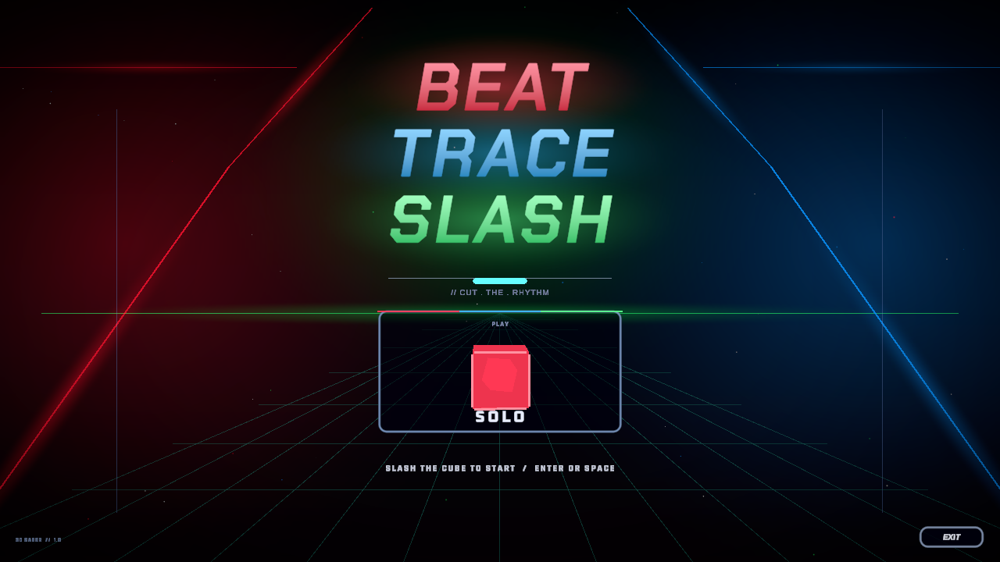
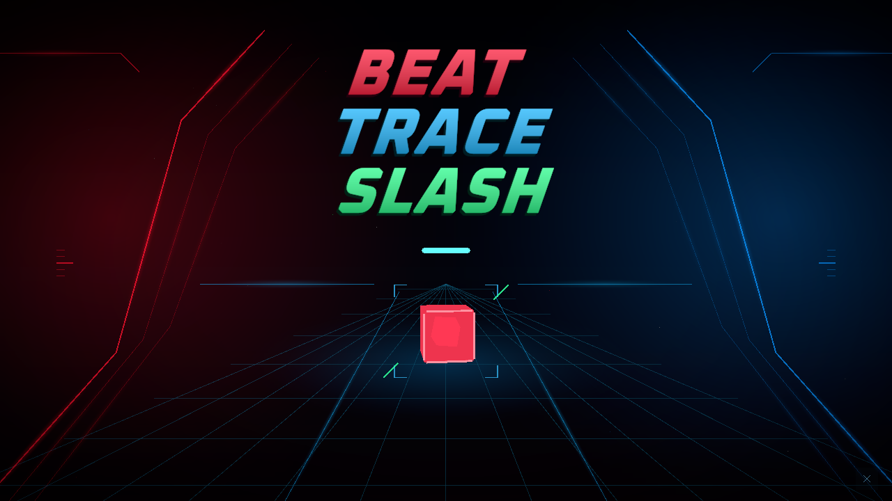

# タイトル画面の整理

ノーツを切って開始する体験と暗い赤青の空間を残し、ロゴと開始ノーツに視線を集める改修。

## 変更前

## 変更後

いずれも実際のTitleシーンをUnity 6000.3.9f1で撮影。720p画像を掲載し、1080pでも確認している。

- PLAY、SOLO、下部の操作説明、タグライン、版表記と丸いカード枠を外した。
- 既存のOxanium ExtraBoldをタイトル内で使用し、字間・傾き・色・影を調整した。他画面の共通フォント設定は変更していない。
- 背景を赤青の段階的なレールと控えめな床の光へ整理した。
- 開始ノーツは四隅と斜めの印で示す。クリック、Enter/Space、セイバー切断による開始経路を維持する。
- 終了操作は右下の×ボタンにした。

## 参考

[Ghostrunner 2公式ページ](https://www.playstation.com/en-us/games/ghostrunner-2/)の鋭い輪郭と暗い空間の光、[WipEout Omega Collection公式ページ](https://www.playstation.com/en-us/games/wipeout-omega-collection/)の幾何学的な形の揃え方を参考にした。ロゴ・画像などの素材は転載していない。これらの作品がOxaniumを使用しているという意味ではない。

## 実画面の再確認

専用コピーをバッチ起動し、`-executeMethod TitleDesignCapture.Render -titleOutput <出力先>`を指定する。実シーンを1080p・720pで保存し、見えているノーツの位置をUIにレイキャストしてクリック、ノーツ切断とSongSelectへの遷移まで確認する。

実機センサーとプロジェクター投影の見え方は、このバッチ確認には含まない。

既存のEditMode `TitleStartNoteTests` は3件すべて成功した。画面撮影では改修前後ともUnity Editor自身の検索インデックス起動時に `ArgumentOutOfRangeException` が出たが、シーン描画・クリック・切断・遷移の確認は完了した。テスト実行ではこの例外は発生していない。
